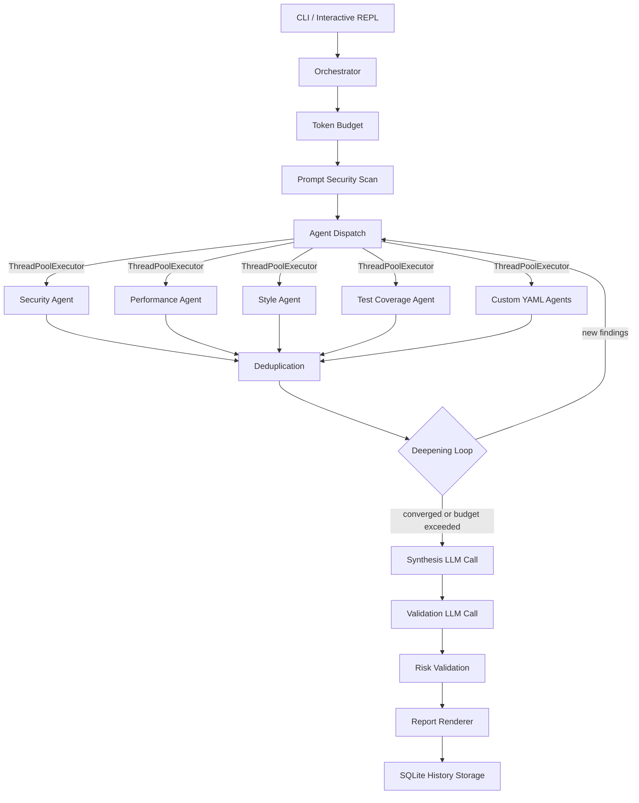
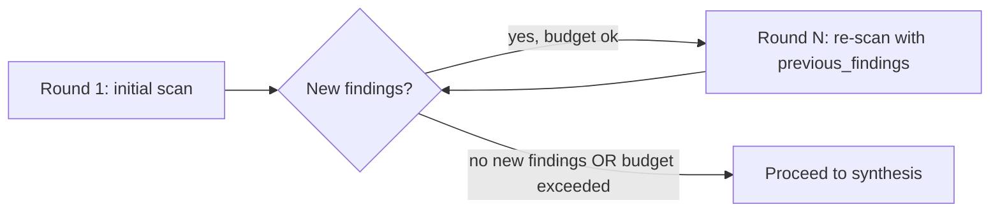

# Architecture

## System Overview



## Pipeline Flow

The orchestrator executes the following stages in order:

```
1. Token Budget        Estimate diff tokens, truncate large diffs (two-pass)
2. Injection Scan      Regex scan for prompt injection patterns in diff
3. Agent Selection     Filter by tier defaults + file_patterns matching
4. Agent Dispatch      Run agents in parallel (ThreadPoolExecutor)
5. Deduplication       Remove cross-agent duplicate findings (configurable strategy)
6. Deepening Loop      Re-run agents with previous findings context (up to N rounds)
7. Synthesis           LLM merges all findings into summary + risk level
8. Validation          LLM checks findings for false positives (multi-round)
9. Risk Validation     Deterministic cap on LLM-proposed risk vs actual findings
10. Report + Storage   Render output, persist to SQLite
```

### Deepening Loop Detail



Each round passes all accumulated findings to agents via `previous_findings`.
Agents are instructed to find issues they missed, without repeating known findings.
New findings are deduplicated against the cumulative set using a `(file_path, line_number, title)` key.
The loop exits on convergence (zero new findings) or when `max_tokens_per_review` is exceeded.

## Component Responsibilities

### CLI (`main.py`)

- Parses `--pr` / `--diff` / `--output` / `--verbose` flags
- Validates input (mutual exclusion, file existence)
- Loads `Settings` from env/.env with friendly error messages
- Parses unified diff format (detects added/deleted/renamed/modified status)
- Triggers custom agent registration before orchestration

### Orchestrator (`orchestrator.py`)

- Central pipeline coordinator -- owns the full review lifecycle
- Applies token budget truncation before any LLM calls
- Runs prompt injection scan and injects findings into results
- Filters agents by `file_patterns` match against diff filenames
- Dispatches agents in parallel with configurable concurrency (`max_concurrent_agents`)
- Handles timeouts: agents exceeding `max_review_seconds` are marked failed
- Runs iterative deepening loop (configurable `max_deepening_rounds`)
- Calls synthesis LLM to merge cross-agent findings into a summary
- Runs validation LLM to detect false positives (configurable `max_validation_rounds`)
- Applies deterministic risk level cap (max 1-level escalation above highest finding severity)
- Builds `ReviewReport` with token usage and cost estimates

### BaseAgent (`agents/base.py`)

- Abstract base class using template method pattern
- `__init_subclass__` validates contract at import time: `name`, `system_prompt` must be non-empty strings; `name` must be unique and match `^[a-z][a-z0-9_]*$`
- `_registered_names: ClassVar[set[str]]` prevents duplicate agent names globally
- `_priority_registry: ClassVar[dict[str, int]]` maps agent names to dedup priority (lower = higher priority, default 100)
- `review()` entry point: format prompt, call LLM, wrap result with timing
- `_extra_context()` hook for agent-specific prompt additions (e.g., language-specific rules)
- `_format_user_prompt()` owns prompt structure: PR metadata, extra context, delimited diff, previous findings
- Hardened system prompt: appends `SECURITY_RULES` to every agent's prompt
- Random UUID delimiter wraps diff content to resist delimiter impersonation
- Graceful failure: LLM parse/empty errors become `AgentResult(status=FAILED)`, not exceptions

### Agent Loader (`agent_loader.py`)

- Discovers YAML agent definitions from configurable directories
- Creates dynamic `BaseAgent` subclasses at runtime via `type()`
- Validates YAML against `CustomAgentSpec` Pydantic model (name, system_prompt, priority, file_patterns, enabled)
- Supports overriding built-in agents by name (temporarily removes from `_registered_names`, restores on failure)
- Discovery order: project-local `.cra/agents/` first, then user-global `~/.cra/agents/`
- Within each directory, files are sorted alphabetically for deterministic load order

### LLM Client (`llm_client.py`)

- Thin wrapper around OpenAI-compatible chat completions API
- Schema injection: Pydantic `model_json_schema()` appended to system prompt as JSON
- Three-layer JSON parsing: (1) strip markdown fences, (2) regex-extract JSON object from prose, (3) retry API call once
- Tenacity retry with exponential backoff + jitter for transient errors (rate limit, timeout, server 5xx)
- Adaptive rate limiting: reads `retry_after` from provider 429 responses
- Thread-safe cumulative token tracking via `threading.Lock`
- Custom exceptions: `LLMResponseParseError` (with truncated raw response), `LLMEmptyResponseError`

### Deduplication (`dedup.py`)

- Removes duplicate findings reported by multiple agents for the same issue
- Four strategies via `DedupStrategy(StrEnum)`:
  - `exact`: match on `(file_path, line_number, title)` -- default
  - `location`: match on `(file_path, line_number)` only
  - `similar`: location match + title similarity >= 0.6 (SequenceMatcher)
  - `disabled`: no deduplication
- Survivor selection: highest severity wins; agent priority (from `BaseAgent._priority_registry`) breaks ties
- Returns new `AgentResult` list with filtered findings; original objects are not mutated

### Token Budget (`token_budget.py`)

- `CharBasedEstimator`: estimates tokens as `ceil(chars / 3)`, intentionally overestimates by 10-20%
- `TokenEstimator` protocol allows plugging in tiktoken or other estimators
- Budget resolution hierarchy: (1) explicit `max_prompt_tokens`, (2) auto-detect from model context window registry, (3) tier preset, (4) FREE fallback (5000 tokens)
- Truncation: two-pass strategy -- sort files by change volume, keep full diff for top files within budget, replace rest with `[TRUNCATED] +N/-N lines` summary
- Cost estimation: custom prices > model pricing registry > None

### Prompt Security (`prompt_security.py`)

- `SECURITY_RULES` constant appended to every agent system prompt (role pinning, diff-as-data framing, format enforcement, anti-reveal)
- `detect_suspicious_patterns()` scans diff text with regex patterns
- High-confidence patterns (instruction override, delimiter impersonation, role injection) generate `Finding` objects
- Low-confidence patterns (review suppression, safety claims, output format manipulation) are logged as warnings only
- Detection is heuristic and never modifies the diff content

### Storage (`storage.py`)

- SQLite-backed review history with WAL mode for concurrent access
- Four tables: `reviews` (indexed metadata + full `report_json`), `agent_results` (per-agent stats), `findings` (individual findings with triage state and PR comment tracking), `finding_settings` (config persistence and findings navigator preferences)
- Indexes on `repo`, `reviewed_at`, `risk_level`, `severity`, `triage_action`, `agent_name`
- Schema versioning with forward migrations (v1 through v5)
- Findings triage state (`open`, `solved`, `false_positive`, `ignored`) and PR comment IDs persist across sessions
- Config overrides saved via `config save` or `Ctrl+A` agent selection persist across restarts
- Query methods: `list_reviews`, `get_review`, `get_trends` (aggregated stats), `get_agent_stats` (per-agent performance), `load_findings_for_review`, `load_all_findings`

### Models (`models.py`)

- All frozen (immutable) Pydantic v2 models with `model_config = {"frozen": True}`
- `StrEnum` types: `Severity`, `Confidence`, `AgentStatus`, `DiffStatus`, `ValidationVerdict`, `ReviewEvent`, `OutputFormat`
- Data flow hierarchy: `DiffFile` -> `ReviewInput` -> `FindingsResponse` -> `AgentResult` -> `ReviewReport`
- `ValidatedFinding` wraps `Finding` with verdict + reasoning + optional `adjusted_severity`
- `ReviewReport.total_findings` is a `@computed_field` aggregating counts across agents

### Report (`report.py`)

- Rich terminal output: colored panels, severity tables, agent summaries
- JSON output mode for programmatic consumption
- Severity color mapping: critical=bold red, high=red, medium=yellow, low=green

### Config (`config.py`)

- `pydantic-settings` based, loads from environment variables and `.env` file
- Supports two built-in LLM providers (NVIDIA, OpenRouter) with per-provider API keys. Custom providers can be added via `~/.cra/providers.json` or `provider add` command. Any OpenAI-compatible server is supported via `llm_base_url` escape hatch.
- Model validator ensures custom pricing is either both set or both unset
- All timeouts, limits, and feature flags are configurable with sensible defaults

### Provider Registry (`providers.py`)

- Loads provider metadata from bundled JSON (`provider_registry.json`) and user overrides (`~/.cra/providers.json`)
- Each provider has: base URL, default model, rate limit RPM, and a list of models with context windows
- User overrides merge on top of bundled defaults: new providers are added, existing ones are extended with new models
- `reload_registry()` allows runtime refresh after `provider add`

### Connection Test (`connection_test.py`)

- Sends a minimal 1-token request (`max_tokens=1`, message: `"hi"`) to verify LLM connectivity
- Runs on startup (when `test_connection_on_start=true`), provider change, model change, base URL change, and API key change
- Rate limit 429 response is treated as "connected" (server is reachable and auth works)
- Returns `(success, message)` tuple for display

## Design Decisions

### Why multi-agent instead of one prompt?

Specialized prompts produce better results than a single overloaded prompt.
Agents run in parallel so total wall time approximates one agent, not four.
Agents can be added, removed, or tuned independently.
Graceful degradation: one agent failure does not lose all results; synthesis skips when <= 1 agent succeeds.

### Why ThreadPoolExecutor, not asyncio?

The system makes a small number of concurrent I/O-bound calls (LLM API).
Threads release the GIL during I/O, giving equivalent throughput for this workload.
No async/await propagation through the entire call stack.
The OpenAI SDK sync client works natively with threads; no adapter needed.

### Why StrEnum for all constrained values?

Reusable across models (`Severity` appears in 4+ places).
Iterable for rendering: `list(Severity)` drives report tables.
Centralized change: update one enum definition, all consumers follow.
Consistent pattern: every constrained string value uses `StrEnum`.

### Why schema injection instead of response_format?

Works with any OpenAI-compatible provider (OpenRouter, NVIDIA, local models).
Not all providers support structured output or tool calling.
Pydantic `model_json_schema()` is the single source of truth for the response contract.
The three-layer parsing strategy handles common LLM output quirks (markdown fences, prose preamble).

### Why tenacity for retry?

Decorator-based API separates retry logic from business logic.
Built-in exponential backoff with jitter prevents thundering herd on rate limits.
Logging hooks (`before_sleep_log`) provide observability without custom code.

### Why SQLite for history?

Zero infrastructure: no database server to deploy or manage.
WAL mode supports concurrent reads from TUI while CLI writes.
Indexed metadata columns enable fast queries without parsing JSON.
Full `report_json` column preserves complete data for export or re-rendering.

### Why YAML for custom agents?

Low barrier: users define a `name`, `system_prompt`, and optional `file_patterns` without writing Python.
Pydantic validation (`CustomAgentSpec`) catches errors at load time with clear messages.
`extra="ignore"` in the spec model provides forward compatibility for new fields.
Override semantics let teams replace built-in agents with domain-specific versions.

### Why priority on BaseAgent?

Deduplication needs a deterministic tiebreaker when two agents report the same issue at the same severity.
Lower priority value = higher importance (security=10 beats style=100).
The priority registry is populated automatically by `__init_subclass__`, so custom YAML agents participate without extra code.

## Custom Agent Extension Model

### YAML Agent Definition

```yaml
name: api_contracts
system_prompt: |
  You are a senior API engineer reviewing changes for breaking contract violations...
description: Checks for backward-incompatible API changes
priority: 20
enabled: true
file_patterns:
  - "*.proto"
  - "*/api/*.py"
  - "*/schemas/*.py"
```

### Discovery and Loading

1. On startup, `register_custom_agents()` calls `discover_agent_dirs()` to find directories
2. Project-local `.cra/agents/` is scanned first, then user-global `~/.cra/agents/`
3. YAML files in each directory are sorted alphabetically and parsed into `CustomAgentSpec`
4. `_create_agent_class()` dynamically creates a `BaseAgent` subclass via `type()`
5. The new class goes through `__init_subclass__` validation (name format, uniqueness, priority type)
6. Custom agents are added to `AGENT_REGISTRY` and become available for selection

### Override Semantics

- A custom agent with the same `name` as a built-in agent replaces it
- The loader temporarily removes the name from `_registered_names` to pass uniqueness validation
- On creation failure, the original registration is restored (atomic override)
- Later directories override earlier ones: user-global overrides project-local

### file_patterns Filtering

- `file_patterns: null` (default) matches all files -- the agent always runs
- When set, the orchestrator checks each diff filename against the patterns using `fnmatch`
- If no diff file matches any pattern, the agent is skipped entirely (no LLM call)

## Cost Control

### Token Tiers

| Tier     | Prompt Budget | Default Agents                             |
|----------|---------------|--------------------------------------------|
| free     | 5,000 tokens  | security only                              |
| standard | 16,000 tokens | security, performance, style, test_coverage |
| premium  | 48,000 tokens | security, performance, style, test_coverage |

### Budget Resolution

Priority order: explicit `max_prompt_tokens` > auto-detect from model context window (40% of window) > tier preset > FREE fallback.

### Truncation Strategy

Large diffs are truncated with a two-pass approach: files sorted by change volume (most changed first), top files kept in full within budget, remaining files replaced with `[TRUNCATED] +N/-N lines` summary.

### Per-Review Token Cap

`max_tokens_per_review` sets a hard ceiling on cumulative tokens across all LLM calls (agents + synthesis + validation). The deepening loop checks this after each round and stops if exceeded.

### Cost Estimation

Each `ReviewReport` includes a `TokenUsage` with `estimated_cost_usd`. Cost is computed from cumulative prompt/completion tokens using: (1) user-provided `llm_input_price_per_m` / `llm_output_price_per_m`, (2) built-in model pricing registry, or (3) `None` if pricing is unknown.

### Deepening and Validation Cost

- Deepening rounds multiply agent LLM calls: N rounds = up to N * agent_count calls
- Validation adds 1 LLM call per round (up to `max_validation_rounds`, default 1)
- Synthesis adds exactly 1 LLM call (skipped when <= 1 agent succeeds)
- Both deepening and validation are off by default (`max_deepening_rounds=1`, `is_validation_enabled=false`)
